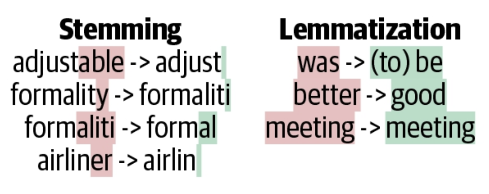
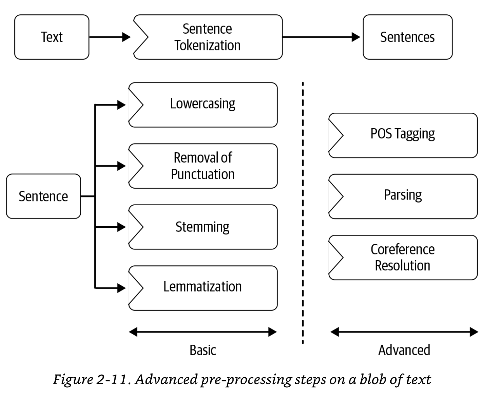
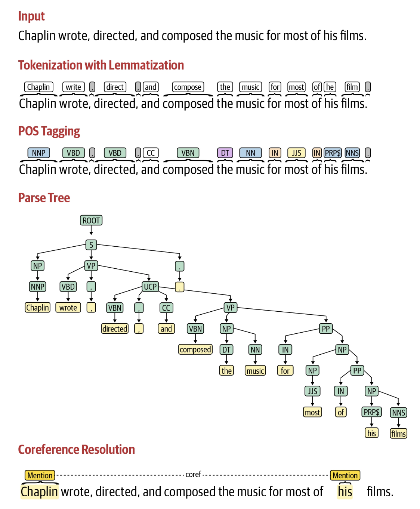

# Pre-processing

---

## Table of Content

---

---

## Preprocessing

> Note: NOT all of them will be executed
> 

> Note2: The steps are NOT performed in order. e.g. Not removing punctuation before lemmatization.
> 

Useful Lib

- All-in-one
    - NLTK
    - spaCy
- Lang detection
    - Polyglot
- POS tagger
    - Parsey McParseface Tagger

Preliminaries

- Word tokenization
- Sentence tokenization

Frequent Steps

- Remove stop words (not meaningful words, such as `an, a, the`)
- Remove punctuation/digits, lowercasing
- Stemming & lemmatization
    
    
    

Others steps

- Text Normalization
    - e.g. phone num in various format → one canonical representation
- Language detection
- Code Mixing & transliteration
    - Code mixing means → one sentence/text piece contains multiple languages
    

Advanced steps

- POS tagging (NLTK, spaCy)
    - e.g. The final goal is to extract organization name. POS tagging can be used during pre-processing first, to tag the noun.
    

### Summary

