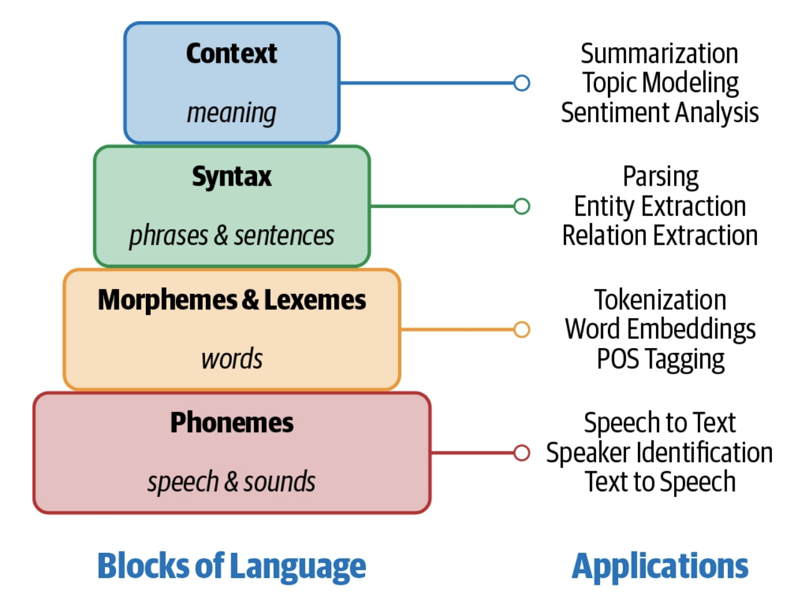

# Language Structure

## Phonemes

- Smallest units of sound
- Each of them normally no meaning
- [EN] can be a letter, or combination of letters
    - i.e. consonant vs vowel
    

## Morphemes

- Smallest unit that has meaning
- Formed by Phonemes
- ** Could be not a word, e.g. prefix, suffix

## Lexemes

- The structural variations of morphemes
- e.g. `Run` vs `Running` = belong to the same lexeme form

## Syntax

- A set of rules to construct sentence (with correct grammar)
- Can represent in Parse Tree

## Context

- Form a particular meaning by various parts.
- Includes long-term reference(`He` → a guy mentioned in last paragraph)
World Knowledge, Common Sense
- Generally, context composes of `semantics` & `pragmatics`
    - Semantics = direct meaning of the words, sentences
    - Pragmatics = external knowledge (e.g. world knowledge, common sense...)