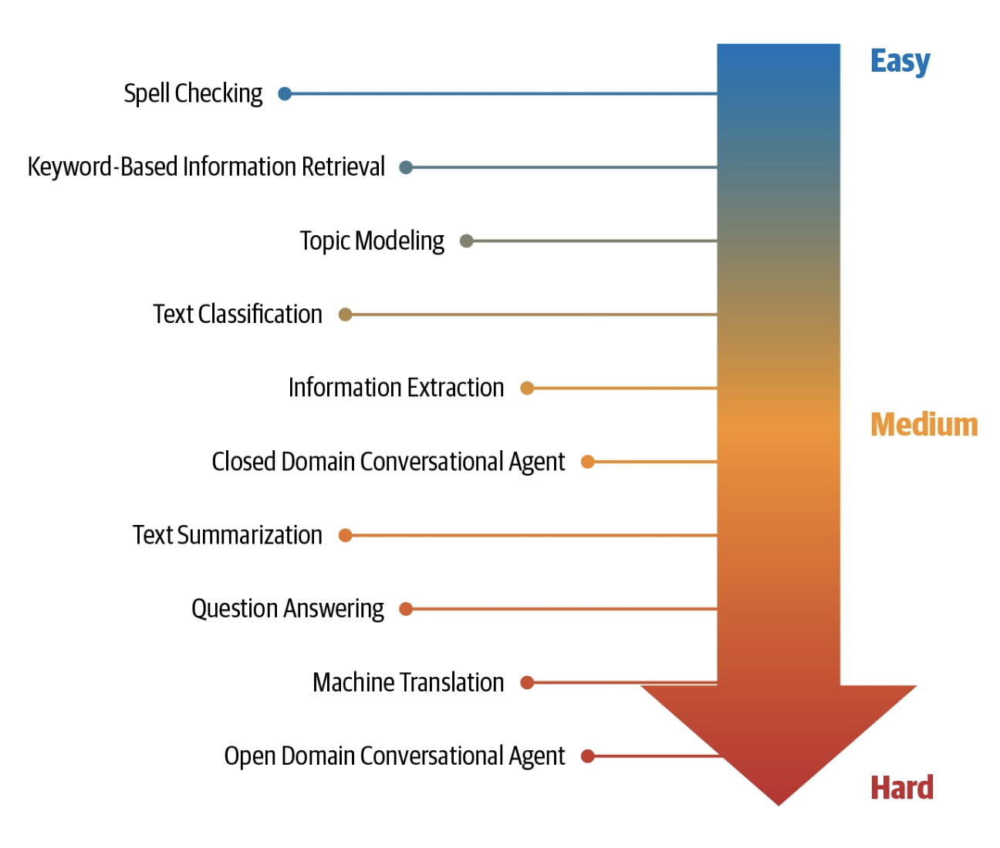

# NLP core task

- Language Modeling (Words prediction)
- Topic Modeling (Categorize topics)
- Text Summarization
- Text classification
- Information Extraction
- Information Retrieval (find a specific doc responding to an user query)
- Conversational Agent
- Question Answering
- Machine Translation

